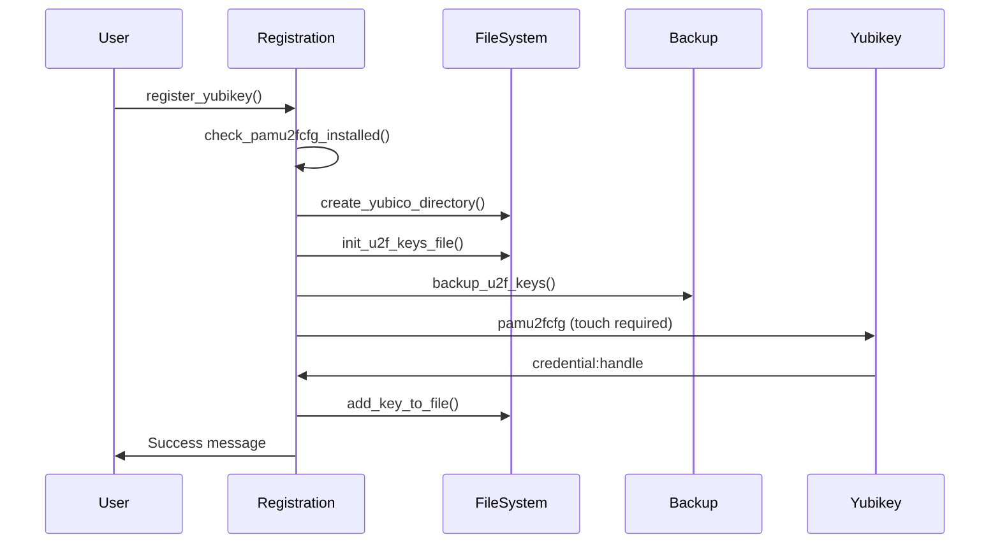
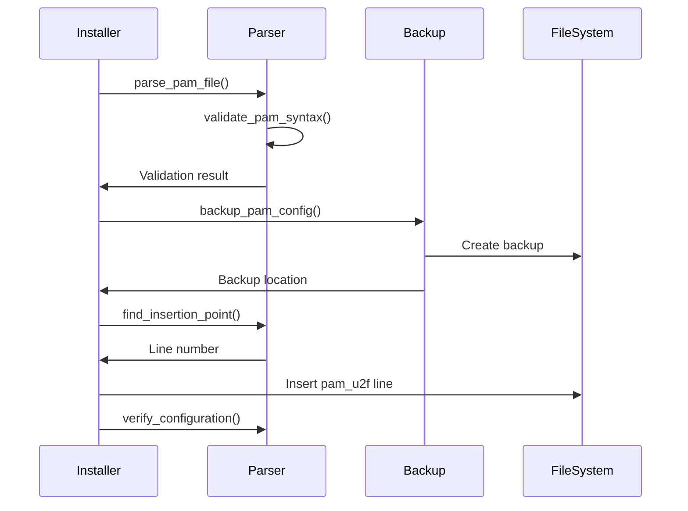

# Component Overview

Detailed documentation of all components in the Yubikey PAM Installer system.

## System Architecture

```
┌─────────────────────────────────────────┐
│           User Interface                │
│  (CLI Commands / Registration Wizard)   │
└─────────────┬───────────────────────────┘
              │
┌─────────────▼───────────────────────────┐
│         Core Components                 │
│  ┌────────────┐  ┌──────────────┐      │
│  │ PAM Parser │  │ Backup System│      │
│  └────────────┘  └──────────────┘      │
│  ┌──────────────────────────────┐      │
│  │   U2F Registration Tool      │      │
│  └──────────────────────────────┘      │
└─────────────┬───────────────────────────┘
              │
┌─────────────▼───────────────────────────┐
│          System Layer                   │
│  (PAM Config / U2F Keys / Yubikey)     │
└─────────────────────────────────────────┘
```

## Core Components

### 1. PAM Parser (`src/pam_parser.sh`)

**Purpose**: Safely parse and modify PAM configuration files.

#### Key Functions

| Function | Purpose | Input | Output |
|----------|---------|-------|--------|
| `parse_pam_line()` | Parse single PAM line | PAM config line | Parsed components |
| `validate_pam_syntax()` | Validate PAM syntax | PAM config line | Valid/Invalid |
| `find_insertion_point()` | Find U2F insertion spot | PAM file path | Line number |
| `has_u2f_module()` | Detect existing U2F | PAM line | Boolean |
| `analyze_pam_structure()` | Analyze PAM config | PAM file path | Structure report |

#### Implementation Details

```bash
# Parse PAM line components
parse_pam_line() {
  # Handles:
  # - Standard lines: auth required pam_unix.so
  # - Complex flags: auth [success=1 default=ignore] pam_succeed_if.so
  # - Include directives: @include common-auth
  # - Comments and blank lines
}

# Find optimal insertion point
find_insertion_point() {
  # Priority:
  # 1. After pam_env.so
  # 2. Before pam_unix.so
  # 3. After first auth line
}
```

#### Error Handling

- Validates syntax before modification
- Preserves original formatting
- Returns specific error codes

### 2. Backup System (`src/backup_system.sh`)

**Purpose**: Create and manage PAM configuration backups.

#### Key Functions

| Function | Purpose | Input | Output |
|----------|---------|-------|--------|
| `create_backup_directory()` | Create timestamped dir | Base path | Backup path |
| `backup_pam_config()` | Backup PAM files | Source, dest | Success/Fail |
| `verify_backup()` | Verify backup integrity | Original, backup | Valid/Invalid |
| `restore_from_backup()` | Restore configuration | Backup path | Success/Fail |
| `log_action()` | Log operations | Action, message | Log entry |

#### Backup Strategy

```bash
# Backup naming convention
/etc/pam.d.backup-YYYYMMDD-HHMMSS/

# Backup process
1. Check disk space (min 10MB)
2. Create timestamped directory
3. Copy with permissions (cp -a)
4. Verify with diff
5. Save metadata
6. Log operation
```

#### Metadata Format

```bash
# .backup_metadata file
timestamp=2025-08-29 15:00:00
description=Pre-installation backup
hostname=server01
user=admin
pam_files_count=25
```

### 3. U2F Registration Tool (`src/u2f_registration.sh`)

**Purpose**: Register Yubikey devices for U2F authentication.

#### Key Functions

| Function | Purpose | Input | Output |
|----------|---------|-------|--------|
| `check_pamu2fcfg_installed()` | Check dependencies | None | Installed/Missing |
| `register_yubikey()` | Main registration | Username | Success/Fail |
| `add_key_to_file()` | Add key to file | Key data, file | Updated file |
| `list_user_keys()` | Show registered keys | Username | Key list |
| `registration_wizard()` | Interactive setup | None | Guided registration |

#### Registration Process

```bash
# Registration workflow
1. Check pamu2fcfg installation
2. Create ~/.config/Yubico directory
3. Initialize u2f_keys file (600 perms)
4. Check for existing keys
5. Backup existing keys
6. Run pamu2fcfg with timeout
7. Parse registration output
8. Add to keys file
9. Verify registration
```

#### Key Storage Format

```
# ~/.config/Yubico/u2f_keys
username:credential:handle[:credential2:handle2...]
```

## Supporting Components

### Demo Scripts

Interactive demonstrations of each component:

| Script | Purpose | Use Case |
|--------|---------|----------|
| `demo_parser.sh` | PAM parser demo | Show parsing capabilities |
| `demo_backup.sh` | Backup system demo | Demonstrate backup/restore |
| `demo_registration.sh` | Registration demo | Mock registration flow |

### Test Runners

Standalone test execution without dependencies:

| Script | Tests | Coverage |
|--------|-------|----------|
| `simple_test.sh` | PAM parser | 19 tests |
| `simple_backup_test.sh` | Backup system | 17 tests |
| `simple_registration_test.sh` | Registration | 21 tests |

## Component Interactions

### Registration Flow



### PAM Modification Flow



## Error Handling

### Error Codes

| Code | Component | Meaning |
|------|-----------|---------|
| 0 | All | Success |
| 1 | General | Generic error |
| 2 | Parser | Invalid syntax |
| 3 | Parser | File not found |
| 4 | Backup | Insufficient space |
| 5 | Backup | Permission denied |
| 6 | Registration | Yubikey not found |
| 124 | Registration | Timeout |

### Error Recovery

```bash
# Parser errors
- Validate before modification
- Keep original intact
- Return specific error message

# Backup errors
- Check space before operation
- Atomic operations (all or nothing)
- Cleanup on failure

# Registration errors
- Clear error messages
- Suggest solutions
- Preserve existing keys
```

## Performance Characteristics

### Component Performance

| Operation | Typical Time | Max Time |
|-----------|-------------|----------|
| Parse PAM file | <100ms | 500ms |
| Create backup | <1s | 5s |
| Verify backup | <500ms | 2s |
| Register key | 2-30s | 30s (timeout) |
| Restore backup | <1s | 5s |

### Resource Usage

```bash
# Disk space
- Backup: ~100KB per backup
- U2F keys: <1KB per user
- Logs: ~10KB typical

# Memory
- Shell scripts: <10MB
- pamu2fcfg: <20MB
```

## Security Model

### Privilege Requirements

| Component | Required Privilege | Reason |
|-----------|-------------------|---------|
| PAM Parser | Read only | Analysis only |
| PAM Modification | Root | Write to /etc/pam.d |
| Backup System | Root | Access /etc/pam.d |
| Registration | User | Write to ~/.config |

### Security Measures

```bash
# File permissions
~/.config/Yubico/u2f_keys: 600
~/.config/Yubico/: 700
/etc/pam.d/*: 644
Backup directories: 700

# Input validation
- Sanitize all user input
- Validate PAM syntax
- Check file paths
```

## Logging and Monitoring

### Log Locations

```bash
# Application log
/var/log/yubikey-pam-installer.log

# System auth log
/var/log/auth.log
/var/log/secure  # RHEL/CentOS

# Journal
journalctl -u gdm  # Desktop manager logs
```

### Log Format

```
[TIMESTAMP] [LEVEL] [COMPONENT] Message
[2025-08-29 15:00:00] [INFO] [BACKUP] Created backup at /etc/pam.d.backup-20250829-150000
[2025-08-29 15:00:01] [INFO] [PARSER] Inserted pam_u2f at line 3
[2025-08-29 15:00:02] [ERROR] [REGISTRATION] Timeout waiting for touch
```

## Extensibility

### Adding New PAM Services

```bash
# Add to parser's service list
SERVICES="sudo su login gdm lightdm sshd newservice"

# Create service-specific handler
configure_newservice() {
  # Custom configuration logic
}
```

### Supporting New Key Types

```bash
# Extend registration for FIDO2
register_fido2_key() {
  # Use fido2-token instead of pamu2fcfg
}
```

## Next Steps

- [PAM Integration](./pam-integration.md) - PAM system details
- [Security Model](./security-model.md) - Security architecture
- [Authentication Flow](./auth-flow.md) - Complete auth process